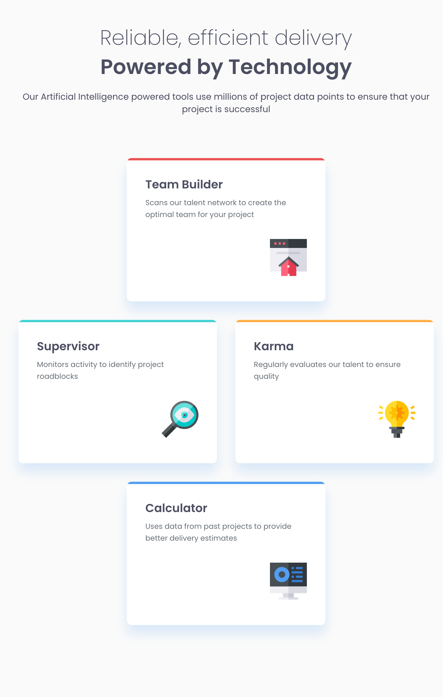

# Frontend Mentor - Four card feature section solution

This is a solution to the [Four card feature section challenge on Frontend Mentor](https://www.frontendmentor.io/challenges/four-card-feature-section-weK1eFYK). 

### Design screenshots

#### Desktop 🖥️

#### Tablet 💻

#### Mobile 📱

### Links

- Solution URL: [GitHub](https://github.com/JuliAlchemDev/FM-four-card-features)
- Live Site URL: [GitHub Pages](https://julialchemdev.github.io/FM-four-card-features/)

## My process
- I initialized a new repository and submitted the project.
- I cleaned up the README file and removed source files that I wouldn’t use.
- I studied the design system in Figma and prepared custom CSS properties, carefully choosing reusable and consistent naming conventions.
 
- Exported image assets from Figma.  
  After checking the design, I noticed all screen sizes use the same image dimensions,  
  so for better organization, I placed all images inside the **assets** folder.  

- Analyzed the design layout and started building the structure with **semantic HTML** and **BEM naming**.  

- Added some **accessibility features**, such as `aria-labelledby` for sections.  
  **Note:** Use `aria-labelledby` when there’s visible text (like a heading, caption, or label) that already describes the element.

- Prepared **media queries** for the next design phase.  

- Used `::before` pseudo-element and `overflow` to style the cards.  
  Had some challenges recreating the exact **shadow styles** from Figma,  
  so I decided to adjust them on my own for a balanced visual result.

### What I learned

- Improved my understanding of **project setup and structure** — from initializing a new repository to cleaning unnecessary files for a clean start.
- Learned to **analyze and extract a design system** from Figma, defining consistent and reusable **CSS custom properties** for colors, typography, and spacing.
- Strengthened my use of **semantic HTML** and **BEM naming conventions** to keep the structure organized and scalable.
- Practiced implementing **accessibility features**, such as using `aria-labelledby` when elements already have a visible descriptive label.
- Refined my approach to **responsive design**, setting up clear media query breakpoints and adapting the layout from mobile to desktop.
- Gained experience using **CSS Grid**, `::before` pseudo-elements, and handling `overflow` to recreate card styles accurately.
- Learned to make **practical design decisions**, such as adjusting shadow intensity and layout details when Figma styles didn’t translate perfectly to code.

### Built with
- **Semantic HTML5**
- **CSS Grid** and **Flexbox**
- **CSS custom properties**
- **Mobile-first workflow**
- **BEM methodology**
- **Accessible markup** with `aria` attributes
- **Responsive design** using `rem` units and media queries
- **Figma** as the main design reference

## Author

- Linkedin - [Julia Alkhimova](https://www.linkedin.com/in/julialkhimova/)
- Frontend Mentor - [@JuliAlchemDev](https://www.frontendmentor.io/profile/JuliAlchemDev)
